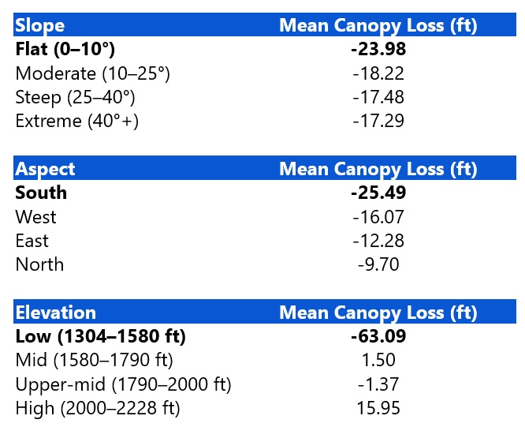
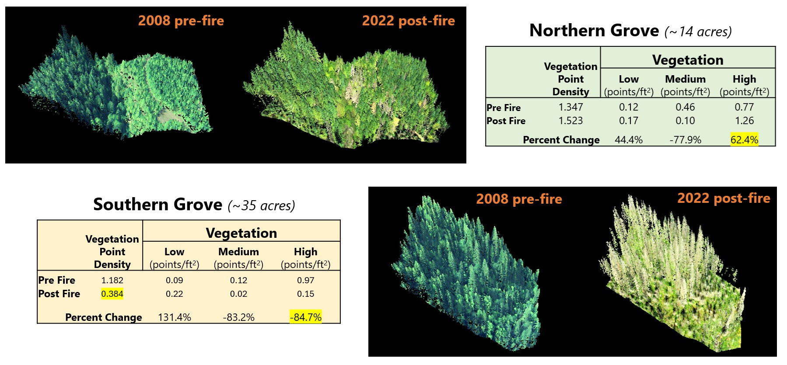

# LiDAR Analysis of Pre‑ and Post‑Fire Forest Structure in the 2020 Beachie Creek Fire  

**Author:** Dustin Littlefield  
**Portfolio:** https://github.com/dustinlit  
**Project Type:** `LiDAR Analysis` `Post-Fire Assessment` `Forest Structure`  
**Technologies:** `USGS LiDAR` `LP360` `ArcGIS Pro` `Change Detection`  
**Last Updated:** April 2026

## Overview
This project utilizes multi-temporal LIDAR to quantify wildfire related impacts on forest and topography within a sample of the 2020 Beachie Creek fire. By comparing pre‑fire and post‑fire datasets, the analysis evaluates canopy loss, surviving vegetation structure, debris accumulation, and topographic stability following a high‑severity wildfire event.

<figure>
  <figcaption style="font-size:0.9em; margin-bottom:8px;">
    <strong>Figure 1.</strong> 3D GIS fusion view of ravine in study area using LiDAR and NAIP imagery  
    <em>Map Author: Dustin Littlefield  
    Spatial Reference: NAD 1983 (2011) Oregon Statewide Lambert (ft), NAVD88 (Geoid 18), US Survey Feet 
    Sources: 2008 USGS 3DEP LiDAR (OR Willamette Valley OLC 2008, Tile 001530), 2022 USGS Western Wildfires A22 LiDAR, 2020 NAIP Orthophoto (0.60 m), 2022 NAIP Orthophoto (0.30 m)</em>
  </figcaption>
  
</figure>

## Data
Two LiDAR datasets collected by the USGS were used in the study. The 2008 data was collected as a baseline to accurately map the regions elevation as part of the 3D elevation program. The 2022 set was part of a series of targeted projects to use LiDAR to study wildfires impacts on terrain in the western united states. 

<figure>
  <figcaption style="font-size:0.9em; margin-bottom:8px;"> <strong>Table 1.</strong> LiDAR scan info 
  </figcaption>
  
</figure>

**2020 – NAIP Orthophoto (0.60 m)**  
Four‑band CNIR aerial imagery collected pre‑fire, used for vegetation condition assessment and contextual mapping.  
**Data Source:** https://earthexplorer.usgs.gov/scene/metadata/full/5e83a340bf820c39/2991624/

**2022 – NAIP Orthophoto (0.30 m)**  
Higher‑resolution four‑band CNIR imagery collected post‑fire, supporting canopy‑loss interpretation and fine‑scale change detection.  
**Data Source:** https://earthexplorer.usgs.gov/scene/metadata/full/5e83a340bf820c39/3223342/

## Study Area 

**Location:** Santiam Canyon, Marion County, Oregon, US  

<figure>
  <figcaption style="font-size:0.9em; margin-bottom:8px;">
    <strong>Figure 2.</strong> Overview of Beachie Creek fire perimeter and selected study area. 
    <em>Map Author: Dustin Littlefield  
    Spatial Reference: WGS 1984 UTM 10N 
    Source: Copernicus Data Space Ecosystem (Sentinel‑2B MSI), European Union/ESA</em>
  </figcaption>
  
</figure>

### Description:
 The Beachie Creek fire was part of a complex of fires along the west coast whose intensity were sparked by an extreme wind event in Autumn of 2020. The fire devastated a large swath of forest in northwest Oregon as it burnt approximately a total of 190,000 acres. Its effects were felt in three counties and destroyed two towns. To better understand the spatial patterns of the fires severity, A small 160-acre area within the burn was chosen to focus on providing greater detail and to expedite point processing.

<figure>
  <figcaption style="font-size:0.9em; margin-bottom:8px;">
    <strong>Figure 3.</strong> Pre- and post-fire detailed view of 160-acre study area in Beachie Creek Fire. 
    <em>Map Author: Dustin Littlefield  
    Spatial Reference: Oregon Statewide Lambert (ft)  
    Source: 2020 NAIP Orthophoto (0.60 m), 2022 NAIP Orthophoto (0.30 m) 
    </em>
  </figcaption>
  
</figure>

Using NAIP imagery, four distinct areas of interest were identified. 
  - Northern Grove - survived the fire 
  - Southern Grove - Exhibits potential high severity burn 
  - Central Clearing - An industrial logging site that has not yet regrown
  - Fish Creek - A ravine cutting through the center
  
  **Notes:**
  The western region was actively being cleared after the fire druing the time of the scans, so Ithese were excluded from the canopy analysis, however, the points were still classified to provide topological context. Cleared patches from industrial timber operations are typical and scattered all throughout this area of the western cascades. Since It is state law in Oregon and good practice that all trees harvested must be replaced, both gthe northern and southern gorves in this study are likely composed of managed regrowth.

<figure>
  <figcaption style="font-size:0.9em; margin-bottom:8px;">
    <strong>Figure 4.</strong> Pre-fire profile view of 160-acre study area in Beachie Creek Fire. 
    <em>Map Author: Dustin Littlefield  
    Spatial Reference: NAD 1983 (2011) Oregon Statewide Lambert (ft), NAVD88 (Geoid 18), US Survey Feet  
    Source: 2008 USGS 3DEP LiDAR (OR Willamette Valley OLC 2008, Tile 001530) 
    </em>
  </figcaption>
  
</figure>

## Preprocessing
- **ArcGIS Pro**
  - Identify Extent of Study Area
  - Define Projection of 2008 Lidar Dataset
  - Extract LAS using mask of study area  

## Methods

  

### Quality Control

- **Point Density:** NPS for both years, density raster, scan angle review  
- **Flight Lines:** check for gaps, visual vertical alignment, generate rasters + RMSE  
- **Ground Consistency:** stable sites only (8–15 patches), avoid canopy cover,  
  DoD = DEM₍2022₎ – DEM₍2008₎, compute zonal RMSE

### Ground Classification

- Classified **2022** LiDAR ground; used **2008 USGS 3DEP** ground as reference  
- Removed low noise prior to ground modeling  
- Applied **Seed & Densify** with conservative settings to avoid misclassifying debris or vegetation  
- Performed **ground thinning** to smooth remaining artifacts  
- Identified a **+0.46 ft bias** in the 2022 ground surface relative to 2008  
  - Too high for fine‑scale debris analysis  
  - Acceptable for canopy‑height modeling

### Vegetation Classification

  - Both 2008 and 2022 scans require vegetation classification
  - Focus on **tall vegetation** for canopy height modeling
  - Classified using current standards in Pacific Northwest.
  - Method: *Height Above Ground*
  - Thresholds
    - Low Vegetation = < 6.5 ft
    - Medium Vegetation = 6.5 - 33 ft
    - High Vegetation = 33 - 250 ft

***Note:*** The post fire classification likely includes a good amount of debris in the low vegetation category but in this case I feel it is acceptable for canopy measurements.

<figure>
  <figcaption style="font-size:0.9em; margin-bottom:8px;">
    <strong>Figure 5.</strong> Profile view of vegetation classification of 160-acre study area in Beachie Creek Fire. 
    <em>Map Author: Dustin Littlefield  
    Spatial Reference: NAD 1983 (2011) Oregon Statewide Lambert (ft), NAVD88 (Geoid 18), US Survey Feet  
    Sources: 2008 USGS 3DEP LiDAR (OR Willamette Valley OLC 2008, Tile 001530), 2022 USGS Western Wildfires A22 LiDAR </em>
  </figcaption>
  
</figure>

### Vegetation Change Detection

#### Canopy Height Model (CHM)

  CHM = DSM − DEM

  - Digital Surface Model (DSM) - Vegetation and Ground classifications, First returns only
  - Digital Elevation Model (DEM) - Ground Points only
  - Canopy Height Model (CHM) = tallest vegetation pixel as height above ground.

#### Difference Canopy Height Model (dCHM)

  dCHM = CHM2008&nbsp;prefire − CHM2022&nbsp;postfire

  - *Positive value = Net canopy growth*
  - *Negative value = Net canopy loss*
 

## Results

### Terrain

- The 2022 LiDAR products provide a clear representation of the study area's topography.  
- Elevation decreases from ~2200 ft in the north to ~1300 ft in the south.  
- A central ravine divides the terrain, with steep west‑facing slopes and gentler east‑facing slopes.  
- The landscape is dominated by south‑ and east‑facing aspects, with very few north‑facing slopes.  
- These warmer, more exposed aspects experience greater solar radiation, making the area more vulnerable to severe fire behavior and canopy loss.

<figure>
  <figcaption style="font-size:0.9em; margin-bottom:8px;">
    <strong>Figure 6.</strong> 2022 LiDAR‑derived slope map with 10‑ft contours for the 160‑acre study area within the Beachie Creek Fire perimeter. Steeper slopes are concentrated along the central ridgeline, while gentler terrain occupies the lower benches and drainage corridors. 
    <em>Map Author: Dustin Littlefield  
    Spatial Reference: NAD 1983 (2011) Oregon Statewide Lambert (ft), NAVD88 (Geoid 18), US Survey Feet  
    Sources: 2022 USGS Western Wildfires A22 LiDAR </em>
  </figcaption>
  
</figure>

<figure>
  <figcaption style="font-size:0.9em; margin-bottom:8px;">
    <strong>Figure 7.</strong> 2022 LiDAR‑derived aspect map showing directional slope exposure across the 160‑acre study area. South‑ and east‑facing slopes dominate the ridgeline, while cooler north‑facing aspects are rare. 
    <em>Map Author: Dustin Littlefield  
    Spatial Reference: NAD 1983 (2011) Oregon Statewide Lambert (ft), NAVD88 (Geoid 18), US Survey Feet  
    Sources: 2008 USGS 3DEP LiDAR (OR Willamette Valley OLC 2008, Tile 001530), 2022 USGS Western Wildfires A22 LiDAR </em>
  </figcaption>
  
</figure>

## Vegetation

- The 2008 and 2022 CHMs show major changes in canopy structure before and after the Beachie Creek Fire.  
- The 2008 CHM displays a continuous, mature canopy in the northern and western areas, with clear height differences between groves.  
- The northern grove appears youngest, while the western zone contains tall, mature (200 ft+) trees indicative of possible old growth.  
- The 2022 CHM shows substantial canopy loss in the western and southern zones, with some areas reduced to ground level.  
- Western canopy loss reflects both fire effects and logging; extreme values along the ravine likely stem from ground‑classification issues.  
- The northern grove retains most of its canopy, highlighting strong spatial contrasts in fire behavior and post‑fire structure.

<figure>
  <figcaption style="font-size:0.9em; margin-bottom:8px;">
    <strong>Figure 8.</strong> LiDAR‑derived Canopy Height Models (CHM). LEFT: 2008 (pre‑fire) RIGHT: 2022 (post‑fire) Illustrates major changes in forest structure following the Beachie Creek Fire. The pre‑fire CHM shows mature closed‑canopy forest, while the post‑fire CHM reveals widespread canopy removal and isolated pockets of surviving vegetation. 
    <em>Map Author: Dustin Littlefield  
    Spatial Reference: NAD 1983 (2011) Oregon Statewide Lambert (ft), NAVD88 (Geoid 18), US Survey Feet  
    Sources: 2008 USGS 3DEP LiDAR (OR Willamette Valley OLC 2008, Tile 001530), 2022 USGS Western Wildfires A22 LiDAR </em>
  </figcaption>
  
</figure>

- The dCHM was generated by subtracting the 2022 post‑fire CHM from the 2008 pre‑fire CHM.  
- Results within the analysis area show a clear spatial pattern of canopy change.  
- The northern grove exhibits net positive canopy growth despite its higher elevation.  
- The southern grove shows substantial canopy loss and represents the most heavily impacted portion of the site.

<figure>
  <figcaption style="font-size:0.9em; margin-bottom:8px;">
    <strong>Figure 9.</strong> LiDAR‑derived difference Canopy Height Model (dCHM) showing canopy height change between 2008 and 2022. Negative values (white) indicate canopy loss from the 2020 Beachie Creek Fire, with the largest reductions occurring on exposed slopes and ridge tops. Limited positive values (black) reflect regrowth or surviving structure in protected terrain.  
    <em>Map Author: Dustin Littlefield  
    Spatial Reference: NAD 1983 (2011) Oregon Statewide Lambert (ft), NAVD88 (Geoid 18), US Survey Feet  
    Sources: 2008 USGS 3DEP LiDAR (OR Willamette Valley OLC 2008, Tile 001530), 2022 USGS Western Wildfires A22 LiDAR </em>
  </figcaption>
  
</figure>

<figure>
  <figcaption style="font-size:0.9em; margin-bottom:8px;">
    <strong>Table 2.</strong> Mean Canopy Loss by Terrain Class  
  </figcaption>
  
</figure>

## Areas of Interest
- The northern grove shows a 60% increase in high‑vegetation points, indicating net canopy growth.  
- Mid‑vegetation points decreased, likely reflecting consumption of lower fuels and limited ladder‑fuel continuity within the grove.  
- The southern grove experienced severe losses, with more than 80% reduction in both medium‑ and high‑vegetation classes.  
- Despite their proximity, the two groves show contrasting outcomes: the northern grove sits higher in the terrain with fewer continuous fuels, while the southern grove occupies lower, more fuel‑connected slopes.  
- These differences illustrate how local topography and fuel arrangement can produce patchy burn effects within an area classified as high burn severity.  
- A clearing between the groves may have contributed to the divergent outcomes, though additional factors such as wind conditions and fuel availability also influence fire behavior.

<figure>
  <figcaption style="font-size:0.9em; margin-bottom:8px;">
    <strong>Figure 10.</strong>  LiDAR‑based comparison of vegetation structure in the Northern (~14 acres) and Southern (~35 acres) groves using pre‑fire (2008) and post‑fire (2022) point clouds.  
    <em>Map Author: Dustin Littlefield  
    Spatial Reference: NAD 1983 (2011) Oregon Statewide Lambert (ft), NAVD88 (Geoid 18), US Survey Feet  
    Sources: 2008 USGS 3DEP LiDAR (OR Willamette Valley OLC 2008, Tile 001530), 2022 USGS Western Wildfires A22 LiDAR </em>
  </figcaption>
  
</figure>

## Lessons Learned
A few key lessons stood out for me while completing this project.
  1) Ground generation is critical and can be a laborious process. It is important to identify the level of accuracy necessary given specific use cases and study extent.
  2) Reducing the extent of this project made it much more manageable and allowed for more efficient experimentation. I can foresee how it is important to refine the process with a smaller area before processing the full extent. 
  3) Narrowing the focus to one specific effect delivers better quality results. 
For instance, the image on the right was part of my attempt at debris classification. And while there was slight success in identifying downed trees in the west and south, the overall raster was too noisy for meaningful analysis. It became evident that debris classification and fuel structure probably require a higher point density to create more accurate ground and vegetation accuracy to generate meaningful results.
