# LiDAR Analysis of Pre‑ and Post‑Fire Forest Structure in the 2020 Beachie Creek Fire  

**Author:** Dustin Littlefield  
**Portfolio:** https://github.com/dustinlit  
**Project Type:** `LiDAR Analysis` `Post-Fire Assessment` `Forest Structure`  
**Technologies:** `USGS LiDAR` `LP360` `ArcGIS Pro` `Change Detection`  
**Last Updated:** April 2026

## Overview
This project utilizes multi-temporal LIDAR to quantify wildfire related impacts on forest and topography within a sample of the 2020 Beachie Creek fire. By comparing pre‑fire and post‑fire datasets, the analysis evaluates canopy loss, surviving vegetation structure, debris accumulation, and topographic stability following a high‑severity wildfire event.

<figure>
  <figcaption style="font-size:0.9em; margin-bottom:8px;">
    <strong>Figure 1.</strong> 3D GIS fusion view of ravine in study area using LiDAR and NAIP imagery  
    <em>Map Author: Dustin Littlefield  
    Spatial Reference: NAD 1983 (2011) Oregon Statewide Lambert (ft), NAVD88 (Geoid 18), US Survey Feet 
    Sources: 2008 USGS 3DEP LiDAR (OR Willamette Valley OLC 2008, Tile 001530), 2022 USGS Western Wildfires A22 LiDAR, 2020 NAIP Orthophoto (0.60 m), 2022 NAIP Orthophoto (0.30 m)</em>
  </figcaption>
  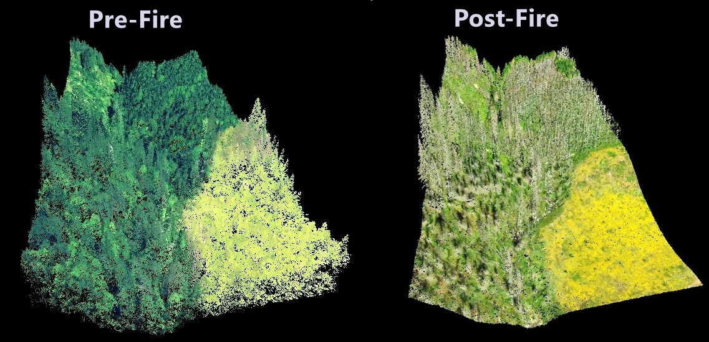
</figure>

<figure>
  <figcaption style="font-size:0.9em; margin-bottom:8px;">
    <strong>Figure 2.</strong> 3D GIS fusion view of stand before and after fire. 
    <em>Map Author: Dustin Littlefield  
    Spatial Reference: NAD 1983 (2011) Oregon Statewide Lambert (ft), NAVD88 (Geoid 18), US Survey Feet 
    Sources: 2008 USGS 3DEP LiDAR (OR Willamette Valley OLC 2008, Tile 001530), 2022 USGS Western Wildfires A22 LiDAR, 2020 NAIP Orthophoto (0.60 m), 2022 NAIP Orthophoto (0.30 m)</em>
  </figcaption>
  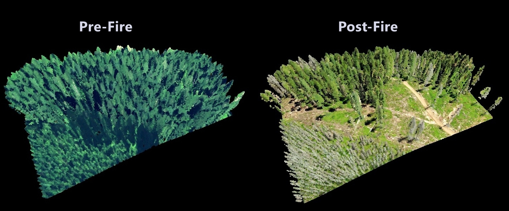
</figure>

## Data

**2008 – OR Willamette Valley OLC 2008 (Tile: 001530)**  
Baseline pre‑fire dataset collected for the USGS 3DEP program representing forest and terrain conditions prior to the Beachie Creek Fire.  
**Data Source:** https://www.sciencebase.gov/catalog/item/64174dabd34eb496d1d165cb

**2022 – USGS Western Wildfires A22**  
Post‑fire dataset acquired after the burn, used to assess structural change and recovery patterns.  
**Data Source:** https://rockyweb.usgs.gov/vdelivery/Datasets/Staged/Elevation/LPC/Projects/OR_WesternWildfires_A22/

<figure>
  <figcaption style="font-size:0.9em; margin-bottom:8px;"> <strong>Table 1.</strong> LiDAR scan info 
  </figcaption>
  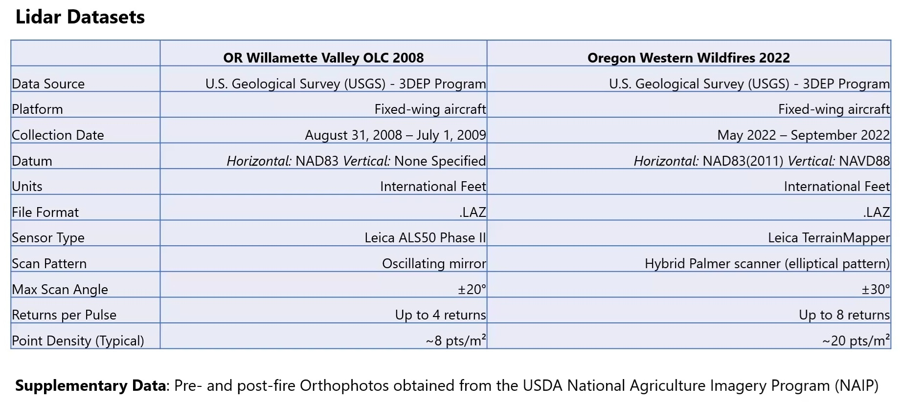
</figure>

**2020 – NAIP Orthophoto (0.60 m)**  
Four‑band CNIR aerial imagery collected pre‑fire, used for vegetation condition assessment and contextual mapping.  
**Data Source:** https://earthexplorer.usgs.gov/scene/metadata/full/5e83a340bf820c39/2991624/

**2022 – NAIP Orthophoto (0.30 m)**  
Higher‑resolution four‑band CNIR imagery collected post‑fire, supporting canopy‑loss interpretation and fine‑scale change detection.  
**Data Source:** https://earthexplorer.usgs.gov/scene/metadata/full/5e83a340bf820c39/3223342/

## Study Area 

**Location:** Santiam Canyon, Marion County, Oregon, US  

<figure>
  <figcaption style="font-size:0.9em; margin-bottom:8px;">
    <strong>Figure 3.</strong> Overview of Beachie Creek fire perimeter and selected study area. 
    <em>Map Author: Dustin Littlefield  
    Spatial Reference: WGS 1984 UTM 10N 
    Source: Copernicus Data Space Ecosystem (Sentinel‑2B MSI), European Union/ESA</em>
  </figcaption>
  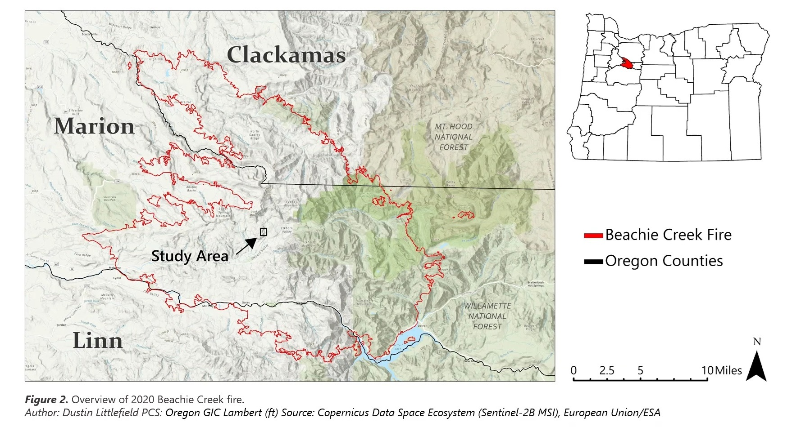
</figure>

### Description:
 A 160 acre site was selected at random in the extent of the overlapping coverage zones of available LIDAR data. The chosen area contains 4 distinct regions of interest. There is a riparian corridor in a ravine carved by fish creek which is flanked to the east and west by steep rising slopes. The western slope is dominated by mature forest, while the eastern slopes, contain younger vegetation that shows evidence of post-harvest regeneration. Finally, in the center and southeast portions of the study area there are two open areas that appear to have been harvested prior to the 2008 USGS 3DEP scans. **

<figure>
  <figcaption style="font-size:0.9em; margin-bottom:8px;">
    <strong>Figure 4.</strong> Pre- and post-fire detailed view of 160-acre study area in Beachie Creek Fire. 
    <em>Map Author: Dustin Littlefield  
    Spatial Reference: Oregon Statewide Lambert (ft)  
    Source: 2020 NAIP Orthophoto (0.60 m), 2022 NAIP Orthophoto (0.30 m) 
    </em>
  </figcaption>
  
</figure>

<figure>
  <figcaption style="font-size:0.9em; margin-bottom:8px;">
    <strong>Figure 5.</strong> Pre-fire profile view of 160-acre study area in Beachie Creek Fire. 
    <em>Map Author: Dustin Littlefield  
    Spatial Reference: NAD 1983 (2011) Oregon Statewide Lambert (ft), NAVD88 (Geoid 18), US Survey Feet  
    Source: 2008 USGS 3DEP LiDAR (OR Willamette Valley OLC 2008, Tile 001530) 
    </em>
  </figcaption>
  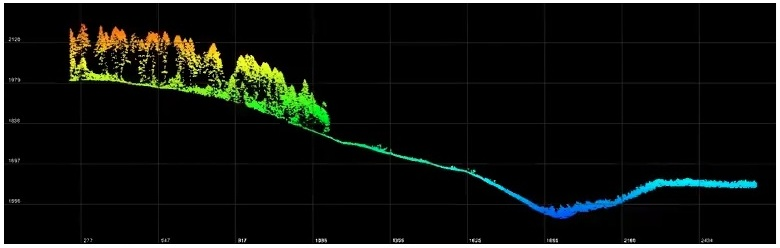
</figure>

## Preprocessing
- **ArcGIS Pro**
  - Identify Extent of Study Area
  - Define Projection of 2008 Lidar Dataset
  - Extract LAS using mask of study area  

## Methods

  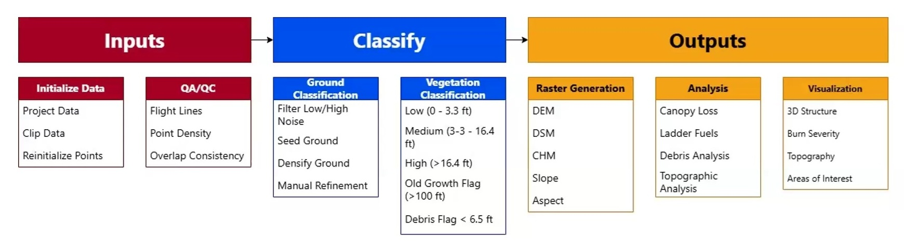

### Quality Control

- **Point Density:** NPS for both years, density raster, scan angle review  
- **Flight Lines:** check for gaps, visual vertical alignment, generate rasters + RMSE  
- **Ground Consistency:** stable sites only (8–15 patches), avoid canopy cover,  
  DoD = DEM₍2022₎ – DEM₍2008₎, compute zonal RMSE

### Ground Classification

- Classified **2022** LiDAR ground; used **2008 USGS 3DEP** ground as reference  
- Removed low noise prior to ground modeling  
- Applied **Seed & Densify** with conservative settings to avoid misclassifying debris or vegetation  
- Performed **ground thinning** to smooth remaining artifacts  
- Identified a **+0.46 ft bias** in the 2022 ground surface relative to 2008  
  - Too high for fine‑scale debris analysis  
  - Acceptable for canopy‑height modeling

### Vegetation Classification

  - Both 2008 and 2022 scans require vegetation classification
  - Focus on **tall vegetation** for canopy height modeling
  - Classified using current standards in Pacific Northwest.
  - Method: *Height Above Ground*
  - *(insert chart of classfication values)*

<figure>
  <figcaption style="font-size:0.9em; margin-bottom:8px;">
    <strong>Figure 6.</strong> Profile view of vegetation classification of 160-acre study area in Beachie Creek Fire. 
    <em>Map Author: Dustin Littlefield  
    Spatial Reference: NAD 1983 (2011) Oregon Statewide Lambert (ft), NAVD88 (Geoid 18), US Survey Feet  
    Sources: 2008 USGS 3DEP LiDAR (OR Willamette Valley OLC 2008, Tile 001530), 2022 USGS Western Wildfires A22 LiDAR </em>
  </figcaption>
  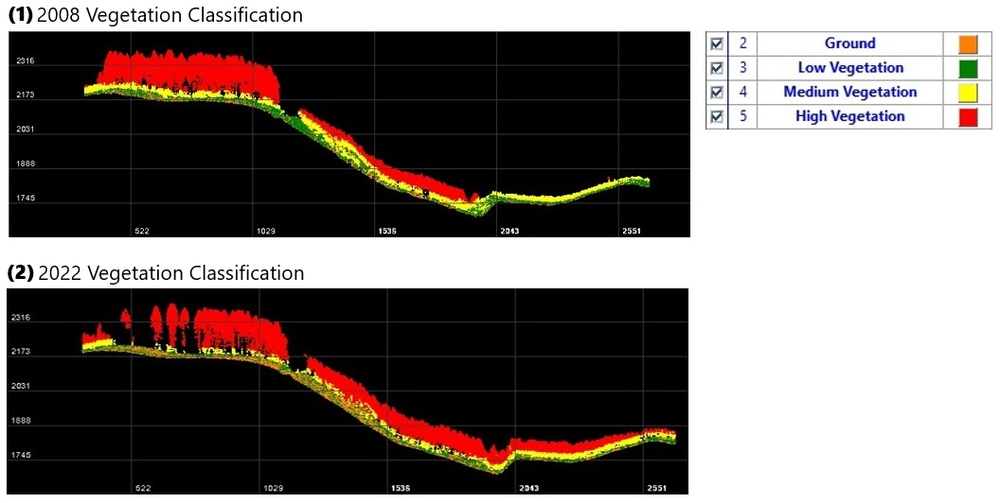
</figure>

### Vegetation Change Detection

#### Canopy Height Model (CHM)

  CHM = DSM − DEM

  - Digital Surface Model (DSM) - Vegetation and Ground classifications, First returns only
  - Digital Elevation Model (DEM) - Ground Points only
  - Canopy Height Model (CHM) = tallest vegetation pixel as height above ground.

#### Difference Canopy Height Model (dCHM)
The dCHM is a raster with measurable differences in elevation where canopy is either gained or lost (forested or burnt). This can be used to **classify burn severity** and identify **areas of interest**.

  dCHM = CHM2008&nbsp;prefire − CHM2022&nbsp;postfire

  - *Positive value = Net canopy growth*
  - *Negative value = Net canopy loss*
 

## Results

### Terrain

<figure>
  <figcaption style="font-size:0.9em; margin-bottom:8px;">
    <strong>Figure 7.</strong> 2022 LiDAR‑derived slope map with 10‑ft contours for the 160‑acre study area within the Beachie Creek Fire perimeter. Steeper slopes are concentrated along the central ridgeline, while gentler terrain occupies the lower benches and drainage corridors. 
    <em>Map Author: Dustin Littlefield  
    Spatial Reference: NAD 1983 (2011) Oregon Statewide Lambert (ft), NAVD88 (Geoid 18), US Survey Feet  
    Sources: 2022 USGS Western Wildfires A22 LiDAR </em>
  </figcaption>
  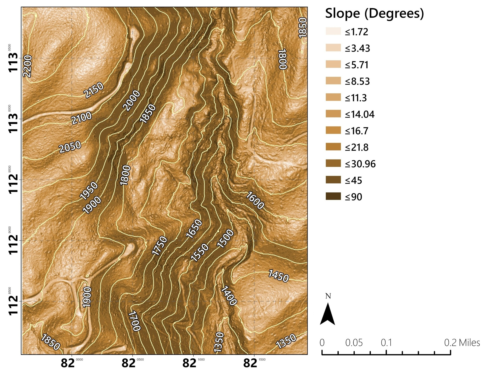
</figure>

<figure>
  <figcaption style="font-size:0.9em; margin-bottom:8px;">
    <strong>Figure 8.</strong> 2022 LiDAR‑derived aspect map showing directional slope exposure across the 160‑acre study area. South‑ and east‑facing slopes dominate the ridgeline, while cooler north‑facing aspects are rare. 
    <em>Map Author: Dustin Littlefield  
    Spatial Reference: NAD 1983 (2011) Oregon Statewide Lambert (ft), NAVD88 (Geoid 18), US Survey Feet  
    Sources: 2008 USGS 3DEP LiDAR (OR Willamette Valley OLC 2008, Tile 001530), 2022 USGS Western Wildfires A22 LiDAR </em>
  </figcaption>
  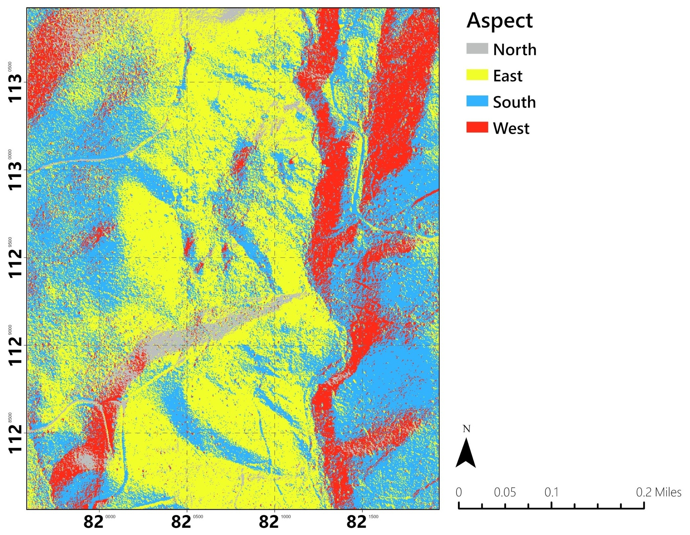
</figure>

## Vegetation

<figure>
  <figcaption style="font-size:0.9em; margin-bottom:8px;">
    <strong>Figure 9.</strong> LiDAR‑derived Canopy Height Models (CHM). LEFT: 2008 (pre‑fire) RIGHT: 2022 (post‑fire) Illustrates major changes in forest structure following the Beachie Creek Fire. The pre‑fire CHM shows mature closed‑canopy forest, while the post‑fire CHM reveals widespread canopy removal and isolated pockets of surviving vegetation. 
    <em>Map Author: Dustin Littlefield  
    Spatial Reference: NAD 1983 (2011) Oregon Statewide Lambert (ft), NAVD88 (Geoid 18), US Survey Feet  
    Sources: 2008 USGS 3DEP LiDAR (OR Willamette Valley OLC 2008, Tile 001530), 2022 USGS Western Wildfires A22 LiDAR </em>
  </figcaption>
  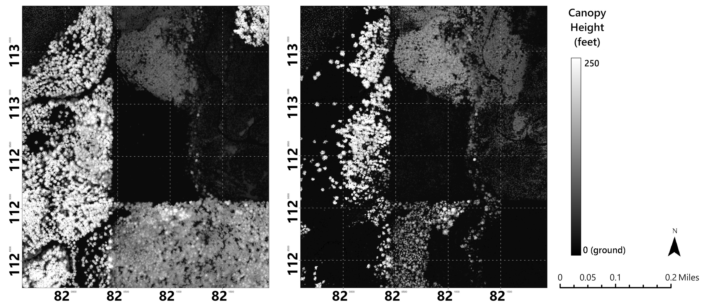
</figure>

<figure>
  <figcaption style="font-size:0.9em; margin-bottom:8px;">
    <strong>Figure 6.</strong> LiDAR‑derived difference Canopy Height Model (dCHM) showing canopy height change between 2008 and 2022. Negative values (white) indicate canopy loss from the 2020 Beachie Creek Fire, with the largest reductions occurring on exposed slopes and ridge tops. Limited positive values (black) reflect regrowth or surviving structure in protected terrain.  
    <em>Map Author: Dustin Littlefield  
    Spatial Reference: NAD 1983 (2011) Oregon Statewide Lambert (ft), NAVD88 (Geoid 18), US Survey Feet  
    Sources: 2008 USGS 3DEP LiDAR (OR Willamette Valley OLC 2008, Tile 001530), 2022 USGS Western Wildfires A22 LiDAR </em>
  </figcaption>
  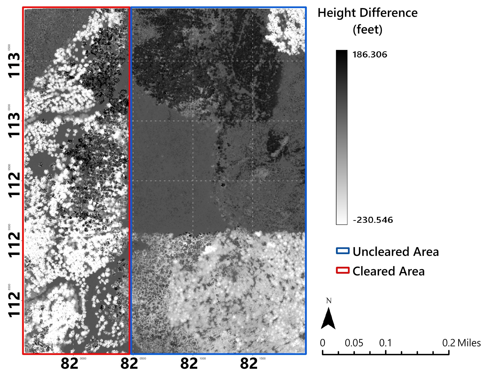
</figure>